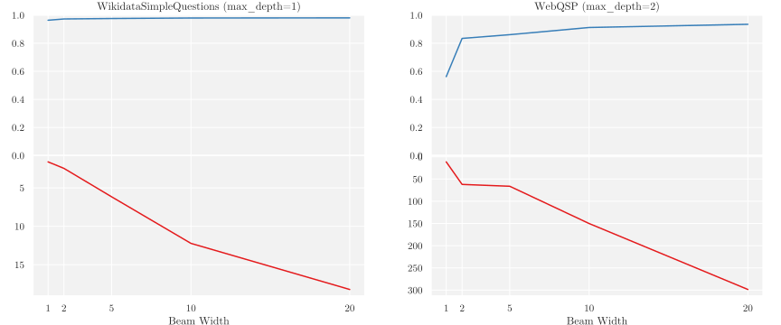
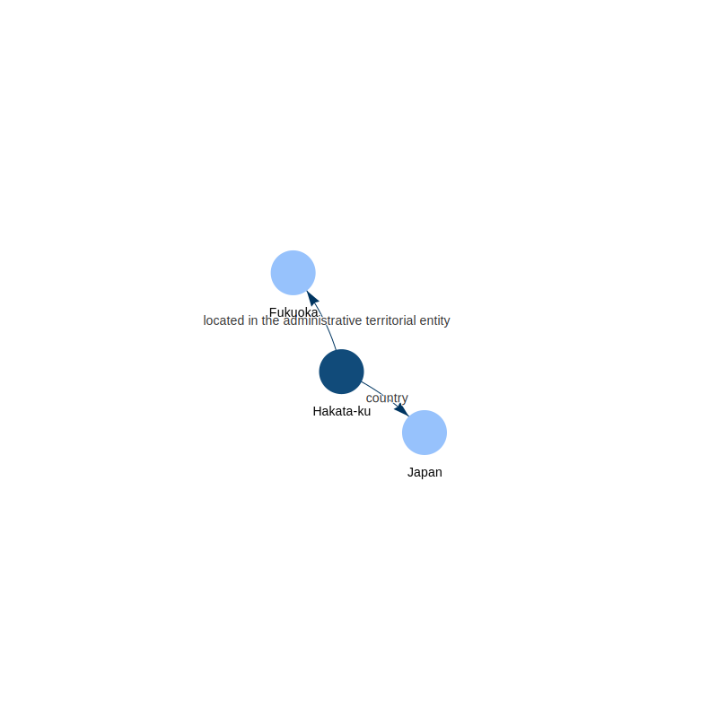

# SRTK Paper Graphs

Here I store the scripts to generate graphs for my SRTK paper.

## Mirroring line chart

## Network graph

The code for [pyvis](https://github.com/WestHealth/pyvis) network generation is from [justinharrell/vis-svg](https://github.com/justinharrell/vis-svg).

